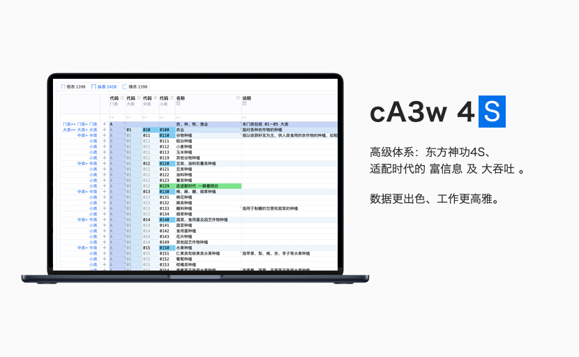
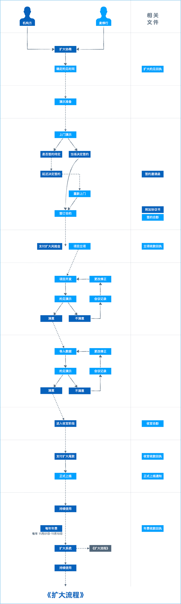

适配高网速、好电脑的，认证机构信息管理系统  
清爽、高级、惊艳、生态，新时代的驾驭感  
主理人：麦修行（大江东去，唯我修行）

[麦修行][]&nbsp;&nbsp;&nbsp;&nbsp;[AI->东方神功][东方神功]&nbsp;[剧情][]&nbsp;[人物][]&nbsp;&nbsp;&nbsp;&nbsp;[原理][]&nbsp;&nbsp;[规则][]&nbsp;&nbsp;[价格][]&nbsp;&nbsp;[购买][]&nbsp;&nbsp;&nbsp;&nbsp;[高奢团][]&nbsp;&nbsp;&nbsp;&nbsp;[发展历程][]

[麦修行]: https://github.com/ca3w/BEST
[东方神功]: https://github.com/ca3w/ai-dongfangshengong
[剧情]: https://github.com/ca3w/dongfangernvqing/blob/main/root/BEST.md
[人物]: https://github.com/ca3w/dongfangernvqing/blob/main/root/renwu.md
[原理]: https://github.com/ca3w/key
[规则]: https://github.com/ca3w/rule
[价格]: https://github.com/ca3w/pricing
[购买]: https://github.com/ca3w/howtobuy
[高奢团]: https://github.com/ca3w/tuan
[发展历程]: https://github.com/ca3w/development

***

# 购买

## 产品信息

#### 封闭系统

由麦修行完全控制并管理软硬件环境

我方不是研发「系统」的「源代码」，然后二次开发、版本冻结，加密之后、或者怎样，一次性全给你，就完事了  
我方是研发「系统」的「垂直AI」，然后缔造「大模型-符文库」的发展生态， 是长期的持续交付， 要做百年企业

我方投入十余年，数百万，研发的是AI，这个AI产出的是非常高级的、整个云端的平台。并不是单纯系统那么简单  
麦修行的意图是：用AI撬动无上高级。所谓无上高级：任何人、一群人想靠手动去敲代码敲出来，只怕是不大可能

关于AI的一切，是封闭的，不但保密，而且绝密！不向你、不向任何人透露一丝一毫，因为我方就是靠这个吃饭的  
你为什么用云？你从来没有买到过真正的源代码，对于你，就需要我这种长期的价值：长期的、专门的、高品质的

#### 产品本质

我方舍得真花时间、真下血本，真专做这个、真深耕这个，你自己看产品效果，是不是真下功夫了，那你自己判断

认证机构如果认可我方努力，那就应该严格按照规则付钱：  
&nbsp;&nbsp;&nbsp;&nbsp;&nbsp;&nbsp;&nbsp;&nbsp;机构授权费：是回收成本的，十分之一，后面加个零、也未必能做到这种程度  
&nbsp;&nbsp;&nbsp;&nbsp;&nbsp;&nbsp;&nbsp;&nbsp;年费：是贴着成本价做资源整合的，合用所产生的利益是我方应得的、应赚的  
&nbsp;&nbsp;&nbsp;&nbsp;&nbsp;&nbsp;&nbsp;&nbsp;大模型铸造费用：差不多工时成本，重用所产生的利益是我方应得的、应赚的

九剑、飞针、莫言...在绝对的实力面前，那些围绕着「穷信息CURD」的一切努力， 无论多少匠心， 都是不堪一击  
货比货得扔，看惯了高维、有颜色的表，那些俗表，可就再也入不了你的“法眼”了，你是何等高贵，自己都不知道

#### 九字真言

看电影 学武功 上系统

九字    |说明&nbsp;&nbsp;&nbsp;&nbsp;&nbsp;&nbsp;&nbsp;&nbsp;&nbsp;&nbsp;&nbsp;&nbsp;&nbsp;&nbsp;&nbsp;&nbsp;&nbsp;&nbsp;&nbsp;&nbsp;&nbsp;&nbsp;&nbsp;&nbsp;&nbsp;&nbsp;&nbsp;&nbsp;&nbsp;&nbsp;&nbsp;&nbsp;&nbsp;&nbsp;&nbsp;&nbsp;&nbsp;&nbsp;&nbsp;&nbsp;&nbsp;&nbsp;&nbsp;&nbsp;&nbsp;&nbsp;&nbsp;&nbsp;&nbsp;&nbsp;&nbsp;&nbsp;&nbsp;&nbsp;&nbsp;&nbsp;&nbsp;&nbsp;&nbsp;&nbsp;&nbsp;&nbsp;&nbsp;&nbsp;&nbsp;&nbsp;&nbsp;&nbsp;&nbsp;&nbsp;&nbsp;&nbsp;&nbsp;&nbsp;&nbsp;&nbsp;&nbsp;&nbsp;&nbsp;&nbsp;&nbsp;&nbsp;&nbsp;&nbsp;&nbsp;&nbsp;&nbsp;&nbsp;&nbsp;&nbsp;&nbsp;&nbsp;&nbsp;&nbsp;&nbsp;&nbsp;&nbsp;&nbsp;&nbsp;&nbsp;&nbsp;&nbsp;&nbsp;&nbsp;&nbsp;&nbsp;&nbsp;&nbsp;&nbsp;&nbsp;&nbsp;
--------|-----------------------------------------------------
看电影  |《笑傲江湖II东方不败》 1992 《新龙门客栈》 1992
学武功  |[东方神功][]
上系统  |然后花钱找麦修行唠嗑（lào kē）

## 联系作者

麦修行

vx: ca3wBEST qq: 83523518

> 抖音西瓜、微信的视频号，搜 ca3wBEST / ca3w麦修行 看视频

#### 意向申请

Windows Word  |macOS Pages  |PDF  |图片
:-------------|:------------|:----|:-----
[意向申请书.docx][win意向申请书]  |[意向申请书.pages][mac意向申请书]  |[意向申请书.pdf][pdf意向申请书]  |[意向申请书.jpg][jpg意向申请书]

[win意向申请书]: https://github.com/ca3w/howtobuy/raw/refs/heads/main/root/static/intentions/意向申请书.docx
[mac意向申请书]: https://github.com/ca3w/howtobuy/raw/refs/heads/main/root/static/intentions/意向申请书.zip
[pdf意向申请书]: https://github.com/ca3w/howtobuy/raw/refs/heads/main/root/static/intentions/意向申请书.pdf
[jpg意向申请书]: https://github.com/ca3w/howtobuy/raw/refs/heads/main/root/static/intentions/意向申请书.jpg

> 下载《意向申请书》，填写内容，加盖公章，然后扫描成图片，发送到我方邮箱  
> 我方凭此相信你是经过高层授意的，有意采用云端的，才会跟你进行必要的沟通

#### 约见演示

首先通过一面看《东方神功》、一面看相关视频，大概了解，如果在云端方式上、价格上能够接受（不接受商议）  
愿意支付「约见演示费」的前提下，与我方协商约见演示的具体时间、具体内容：

约见演示内容：  
&nbsp;&nbsp;&nbsp;&nbsp;&nbsp;&nbsp;&nbsp;&nbsp;㈠. 你指定的认证体系，初审/再认证、监督， 从申请到发证， 大致的流程给你走一遍  
&nbsp;&nbsp;&nbsp;&nbsp;&nbsp;&nbsp;&nbsp;&nbsp;㈡. 针对《东方神功》中的五绝进行答疑：九剑、飞针、莫言、神驭、归宗，你都要会  
&nbsp;&nbsp;&nbsp;&nbsp;&nbsp;&nbsp;&nbsp;&nbsp;㈢. 其他你关心的问题，可以在约见前提出，我方到时给你答案

如果贵方要求演示的是「较为特别的」认证体系，我方只能演示 「`A001-TIXI` 体系」 或 「`B001-CHPI` 产品」

品质上的问题：  
&nbsp;&nbsp;&nbsp;&nbsp;&nbsp;&nbsp;&nbsp;&nbsp;东方神功，真实是由AI出码产生（但不向你证明、透露更多细节），大部分都是制式的  
&nbsp;&nbsp;&nbsp;&nbsp;&nbsp;&nbsp;&nbsp;&nbsp;这个「制式」的意思就是：已经大部分都实现AI出码，是标准化的，人工的部分很少的  
&nbsp;&nbsp;&nbsp;&nbsp;&nbsp;&nbsp;&nbsp;&nbsp;不存在：赶时间、对付做、糊弄做、多人水准不一、像是新手做的，等等这些不可能的  
&nbsp;&nbsp;&nbsp;&nbsp;&nbsp;&nbsp;&nbsp;&nbsp;不只是AI的（想对付、想糊弄都没办法），而且是平台、大模型的，也没法单独糊弄你

时间上的问题：  
&nbsp;&nbsp;&nbsp;&nbsp;&nbsp;&nbsp;&nbsp;&nbsp;每个主剑级大模型，至少需要100天才能做出来，由于其他事项、以及反复，就可能更久  
&nbsp;&nbsp;&nbsp;&nbsp;&nbsp;&nbsp;&nbsp;&nbsp;甚至可能要一年多，但多花时间是有意义的， 不只是做好管理数据， 更是做到驾驭数据

提前想的问题：  
&nbsp;&nbsp;&nbsp;&nbsp;&nbsp;&nbsp;&nbsp;&nbsp;你想做的认证体系，原来你用Excel搞的：《审核项目实施情况（2025年3月至5月）》  
&nbsp;&nbsp;&nbsp;&nbsp;&nbsp;&nbsp;&nbsp;&nbsp;不管你当地怎么叫，反正就是这个东西，不同的认证体系，提前好好琢磨琢磨，怎么弄  
&nbsp;&nbsp;&nbsp;&nbsp;&nbsp;&nbsp;&nbsp;&nbsp;不再像你原来系统，弄成这样：  
&nbsp;&nbsp;&nbsp;&nbsp;&nbsp;&nbsp;&nbsp;&nbsp;&nbsp;&nbsp;&nbsp;&nbsp;&nbsp;&nbsp;&nbsp;&nbsp;「合同管理」->「审核管理」->「评定管理」->...（零散的，要到处点的）  
&nbsp;&nbsp;&nbsp;&nbsp;&nbsp;&nbsp;&nbsp;&nbsp;按东方神功的设计，弄成这样：  
&nbsp;&nbsp;&nbsp;&nbsp;&nbsp;&nbsp;&nbsp;&nbsp;&nbsp;&nbsp;&nbsp;&nbsp;&nbsp;&nbsp;&nbsp;&nbsp;「业务目录」（合一的，一共就一个！一个页面看全部、而且一眼看明白）  
&nbsp;&nbsp;&nbsp;&nbsp;&nbsp;&nbsp;&nbsp;&nbsp;意思就是：  
&nbsp;&nbsp;&nbsp;&nbsp;&nbsp;&nbsp;&nbsp;&nbsp;&nbsp;&nbsp;&nbsp;&nbsp;&nbsp;&nbsp;&nbsp;&nbsp;什么行业、范围、技术领域、产品目录，甚至是体系、产品的「业务目录」  
&nbsp;&nbsp;&nbsp;&nbsp;&nbsp;&nbsp;&nbsp;&nbsp;&nbsp;&nbsp;&nbsp;&nbsp;&nbsp;&nbsp;&nbsp;&nbsp;麦修行都能直接拿出做好的：高维的、有颜色的，你看着挑挑毛病就行了  
&nbsp;&nbsp;&nbsp;&nbsp;&nbsp;&nbsp;&nbsp;&nbsp;&nbsp;&nbsp;&nbsp;&nbsp;&nbsp;&nbsp;&nbsp;&nbsp;但如果是「较为特别的」认证体系，甚至是二方，那没现成的，提前想想

&nbsp;&nbsp;&nbsp;&nbsp;&nbsp;&nbsp;&nbsp;&nbsp;深度一句：  
&nbsp;&nbsp;&nbsp;&nbsp;&nbsp;&nbsp;&nbsp;&nbsp;&nbsp;&nbsp;&nbsp;&nbsp;&nbsp;&nbsp;&nbsp;&nbsp;时代变了、条件好了，原来不可能的，现在成为可能：  
&nbsp;&nbsp;&nbsp;&nbsp;&nbsp;&nbsp;&nbsp;&nbsp;&nbsp;&nbsp;&nbsp;&nbsp;&nbsp;&nbsp;&nbsp;&nbsp;你原来的《审核项目实施情况（2025年3月至5月）》那种Excel，高维有颜色、清爽的，  
&nbsp;&nbsp;&nbsp;&nbsp;&nbsp;&nbsp;&nbsp;&nbsp;&nbsp;&nbsp;&nbsp;&nbsp;&nbsp;&nbsp;&nbsp;&nbsp;现在使用富信息、AI技术，可以直接在网页上能实时的美好呈现，而且每一块都这样做。

#### 明谋明牌

作者麦修行个人认为： mysql->php 根本就不适合做认证机构信息管理系统，简直如同儿戏， 那只是数据表管理器  
纵使把背后的数据表，都管理清楚了，那也离符合时代需要的系统差距甚远，甚至没有可能， 终究是底蕴决定一切

&nbsp;&nbsp;&nbsp;&nbsp;&nbsp;&nbsp;&nbsp;&nbsp;真正的好系统：必须是自己研发底蕴，否则终将是陷入俗流，成为低端  
&nbsp;&nbsp;&nbsp;&nbsp;&nbsp;&nbsp;&nbsp;&nbsp;新时代的人们，具备极高的识别能力，不好的东西用于工作，会厌恶的

&nbsp;&nbsp;&nbsp;&nbsp;&nbsp;&nbsp;&nbsp;&nbsp;所以：  
&nbsp;&nbsp;&nbsp;&nbsp;&nbsp;&nbsp;&nbsp;&nbsp;以后上系统，更多的是选择技术底蕴，选择用哪个高级体系，选择云端  
&nbsp;&nbsp;&nbsp;&nbsp;&nbsp;&nbsp;&nbsp;&nbsp;而不是无视高网速、无视好电脑，买一个加密的、低端的数据表管理器

整个系统/平台，不是单纯简单的 mysql->php 那种数据表式的传统设计，而是作者打破常规、另辟蹊径自主发展的  
是作者麦修行采用Go (Golang)编写的，写了大量算法的，而且自主研发了相应的AI协助体系，是蓝星级的稀缺底蕴

莫说是：「机构授权费 x10」，就算 x30 你也是很难做到的， 而且不是做不做得到的问题， 是有没有可能性的问题

&nbsp;&nbsp;&nbsp;&nbsp;&nbsp;&nbsp;&nbsp;&nbsp;麦修行的自信：  
&nbsp;&nbsp;&nbsp;&nbsp;&nbsp;&nbsp;&nbsp;&nbsp;&nbsp;&nbsp;&nbsp;&nbsp;&nbsp;&nbsp;&nbsp;&nbsp;不是：九剑 + 飞针 + 莫言 + 神驭 + 归宗 + 万行 + .... = 有点好看、有点高级  
&nbsp;&nbsp;&nbsp;&nbsp;&nbsp;&nbsp;&nbsp;&nbsp;&nbsp;&nbsp;&nbsp;&nbsp;&nbsp;&nbsp;&nbsp;&nbsp;而是：九剑 + 飞针 = 这就够了！一骑绝尘、遥遥领先！根本不需要莫言出手

&nbsp;&nbsp;&nbsp;&nbsp;&nbsp;&nbsp;&nbsp;&nbsp;**一个是「表管理的零零散散」，另一个是「驾驭数据的高级体系」，不在一个层级**

&nbsp;&nbsp;&nbsp;&nbsp;&nbsp;&nbsp;&nbsp;&nbsp;所以：这是麦修行在蓝星自己点亮的科技树，是长期发展的体系，还有很多事要做  
&nbsp;&nbsp;&nbsp;&nbsp;&nbsp;&nbsp;&nbsp;&nbsp;麦修行根本没时间和精力和你去议价、扯皮，所以就是明码实价，云端一体发展的

麦修行的意图是：不接任何转包、不搞任何特殊，一体发展、明码实价，专做这个、只做这个，让有条件的机构清爽

## 首签流程

## 扩大流程

### 《首签流程》中的风险金尾款比例

费用种类          |&nbsp;&nbsp;&nbsp;&nbsp;风险金（预付款）  |尾款（完工款）  |说明&nbsp;&nbsp;&nbsp;&nbsp;&nbsp;&nbsp;&nbsp;&nbsp;&nbsp;&nbsp;&nbsp;&nbsp;&nbsp;&nbsp;&nbsp;&nbsp;&nbsp;&nbsp;&nbsp;&nbsp;&nbsp;&nbsp;&nbsp;&nbsp;&nbsp;&nbsp;&nbsp;&nbsp;&nbsp;&nbsp;&nbsp;&nbsp;&nbsp;&nbsp;&nbsp;&nbsp;&nbsp;&nbsp;&nbsp;&nbsp;&nbsp;&nbsp;&nbsp;&nbsp;&nbsp;&nbsp;&nbsp;&nbsp;&nbsp;&nbsp;&nbsp;&nbsp;&nbsp;&nbsp;&nbsp;&nbsp;&nbsp;&nbsp;&nbsp;&nbsp;&nbsp;&nbsp;&nbsp;&nbsp;&nbsp;&nbsp;&nbsp;&nbsp;&nbsp;
-----------------:|--------------------:|:--------------------|:---------------------------------------
约见演示费        |100%                 |0%                   |一定收取，不能跳过
机构授权费        |20%                  |80%                  |
基础年费          |0%                   |100%                 |见：[首签年费计算][]
附加年费          |0%                   |100%                 |见：[首签年费计算][]
云号创建费        |0%                   |100%                 |
大模型铸造费用    |起铸费用             |剑成总价 - 起铸费用  |
存储扩容年费附加  |0                    |根据需要             |如果超出整合容量，见：[资源整合策略][]
通信服务消费充值  |0                    |RMB 1000.00          |少量充值以备万一，见：[资源整合策略][]

[资源整合策略]: https://github.com/ca3w/rule#资源整合策略
[首签年费计算]: #首签年费计算

#### 首签年费计算

当年年费：从「约定正式上线日」到「当年12月31日」，按天数计算需缴纳的费用，和CRC一样，也抹到百位  
次年年费：如果已过统一缴费期（11月01日 - 11月10日），还要缴纳次年年费。否则等到了统一缴费期，再缴纳

### 《扩大流程》中的风险金尾款比例

费用种类          |&nbsp;&nbsp;&nbsp;&nbsp;&nbsp;&nbsp;&nbsp;&nbsp;风险金（预付款）  |尾款（完工款）  |说明&nbsp;&nbsp;&nbsp;&nbsp;&nbsp;&nbsp;&nbsp;&nbsp;&nbsp;&nbsp;&nbsp;&nbsp;&nbsp;&nbsp;&nbsp;&nbsp;&nbsp;&nbsp;&nbsp;&nbsp;&nbsp;&nbsp;&nbsp;&nbsp;&nbsp;&nbsp;&nbsp;&nbsp;&nbsp;&nbsp;&nbsp;&nbsp;&nbsp;&nbsp;&nbsp;&nbsp;&nbsp;&nbsp;&nbsp;&nbsp;&nbsp;&nbsp;&nbsp;&nbsp;&nbsp;&nbsp;&nbsp;&nbsp;&nbsp;&nbsp;&nbsp;&nbsp;&nbsp;&nbsp;&nbsp;&nbsp;&nbsp;&nbsp;&nbsp;&nbsp;&nbsp;&nbsp;&nbsp;&nbsp;&nbsp;&nbsp;&nbsp;&nbsp;&nbsp;
-----------------:|--------------------:|:--------------------|:---------
云号创建费        |0%                   |100%                 |如果创建
大模型铸造费用    |起铸费用             |剑成总价 - 起铸费用  |
